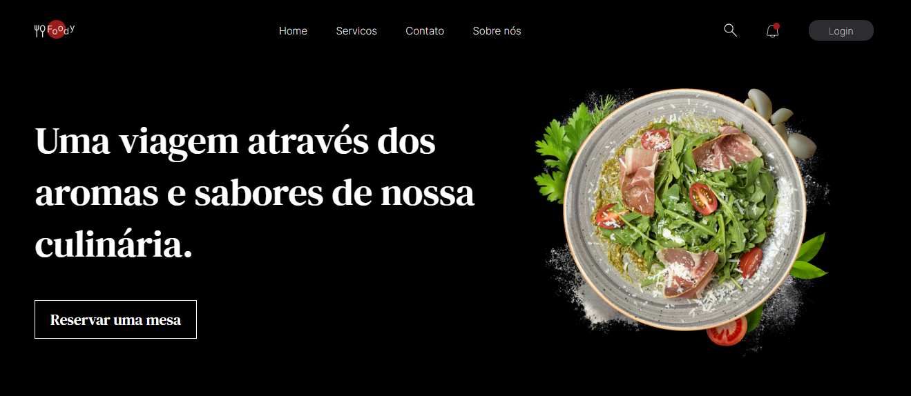

# Foody App

Projeto de um restauranto, feito uma API com json-server para fazer a requisição das infromações da home, Usando rotas com react-router e usando get e post na página de Login. Além de um visual impactante e animações com css.




Contribuidores 
 
| [<br><sub>Jennifer Gabriely</sub>](https://github.com/JenniGabriely01) |  [<br><sub>Kauã Campos</sub>](https://github.com/KauoKampos) 
| :---: | :---: 

## Como rodar a aplicação :arrow_forward:

No terminal, clone o projeto: 

```
git clone https://github.com/JenniGabriely01/foodyReact.git
```
Ainda no terminal, baixe o node_modules

```
npm install
```
inicialize a API
```
npx json-server --watch db.json port 3000
```

Abra outro terminal e inicialize o projeto e abra a localhost
```
npm run dev
```


